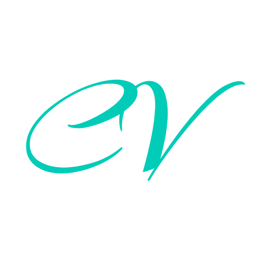
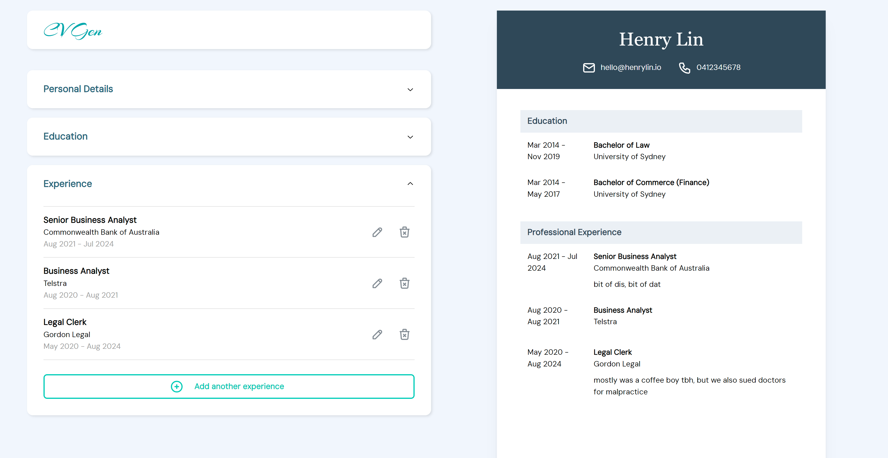

<!-- PROJECT SHIELDS -->

[![Issues][issues-shield]][issues-url]
[![MIT License][license-shield]][license-url]
[![LinkedIn][linkedin-shield]][linkedin-url]

<!-- PROJECT LOGO -->
 

  

<h3 align="center">CV Gen</h3>

  

    React.JS web application to generate your curriculum vitae (CV).
     
     
    <a href="https://generate-your-cv.netlify.app/">View demo</a>
    ·
    <a href="https://github.com/henrylin03/cv-generator/issues/new">Add issue</a>
  

<!-- ABOUT THE PROJECT -->

## About

Generate your curriculum vitae (CV) or resume in your browser by entering your personal details, education, and professional experiences.

Your details are not saved in any database, as the web app is entirely client-side, stored in React States.

### Built with

<!-- CONTRIBUTING -->

## Contributing

If you have a suggestion that would make CV Gen better, please feel free to [add an issue](https://github.com/henrylin03/cv-generator/issues/new) and/or fork and create a pull request.

<!-- LICENSE -->

## License

Distributed under the MIT License. See `LICENSE.txt` for more information.

## Acknowledgements

- Design was taken from previous Odin Project submissions by [Shark](https://github.com/Sharkri/cv-application) and [Matheus Rodrigues](https://github.com/rmathr/cv-project)
- Wireframed using [draw.io](https://app.diagrams.net/)
- Icons from [Tabler](https://tabler.io/icons)
- Colour palette suggestions by [Coolors](https://coolors.co/)
- The present README file was heavily influenced by the ["Best-README-Template"](https://github.com/othneildrew/Best-README-Template)
- Favicon was generated by [favicon.io](https://favicon.io)
- Markdown badges by [ileriayo](https://github.com/Ileriayo/markdown-badges)

(<a href="#readme-top">back to top</a>)

<!-- MARKDOWN LINKS & IMAGES -->

[issues-shield]: https://img.shields.io/github/issues/henrylin03/cv-generator.svg?style=for-the-badge
[issues-url]: https://github.com/henrylin03/cv-generator/issues
[license-shield]: https://img.shields.io/github/license/henrylin03/cv-generator.svg?style=for-the-badge
[license-url]: https://github.com/henrylin03/cv-generator/blob/main/LICENSE
[linkedin-shield]: https://img.shields.io/badge/-LinkedIn-black.svg?style=for-the-badge&logo=linkedin&colorB=555
[linkedin-url]: https://www.linkedin.com/in/henrylin03/
